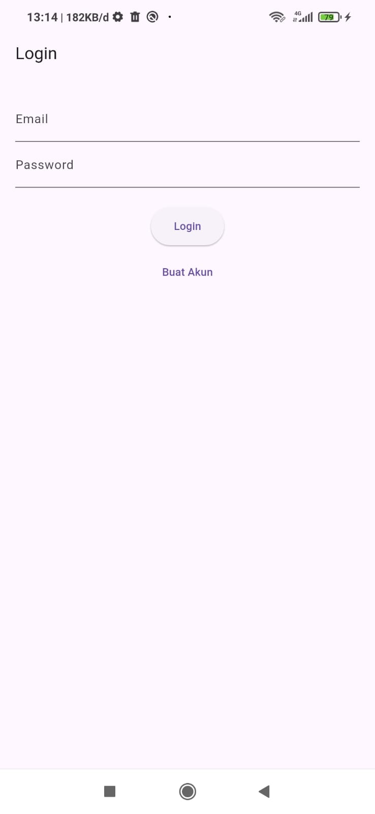
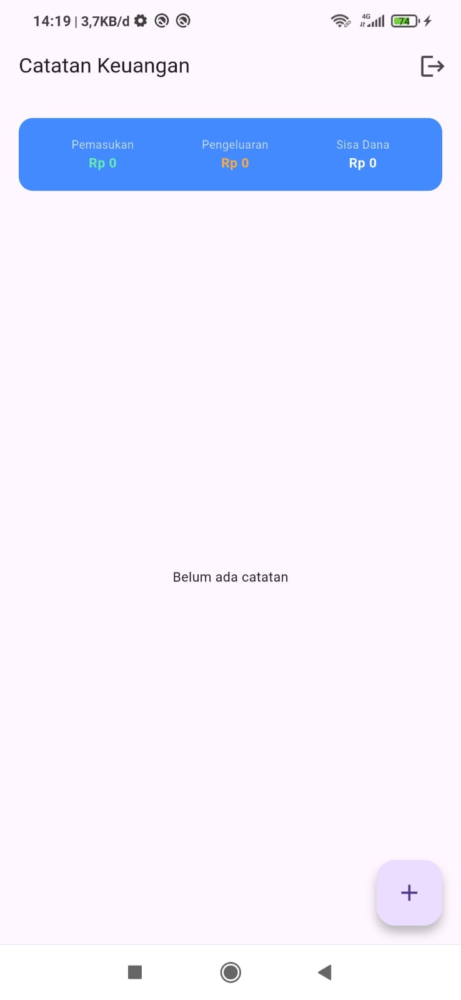
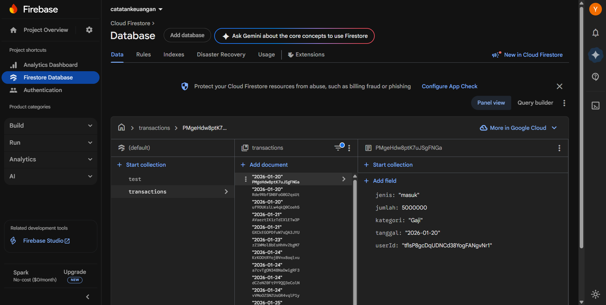
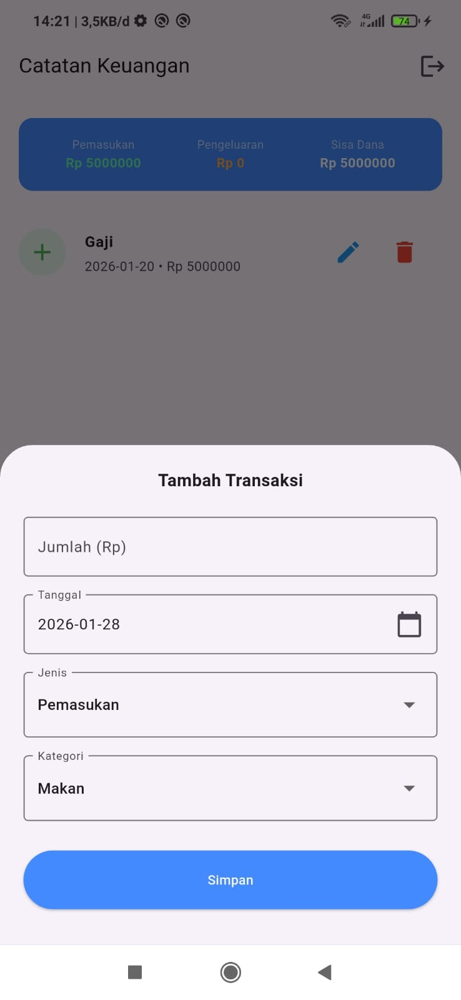
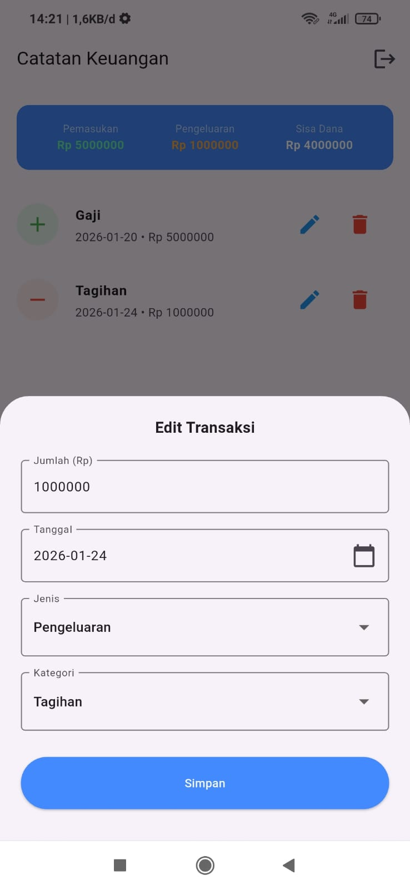
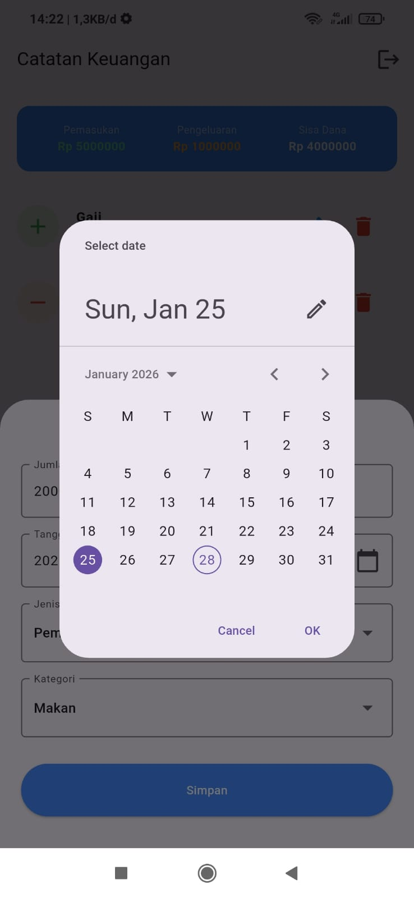
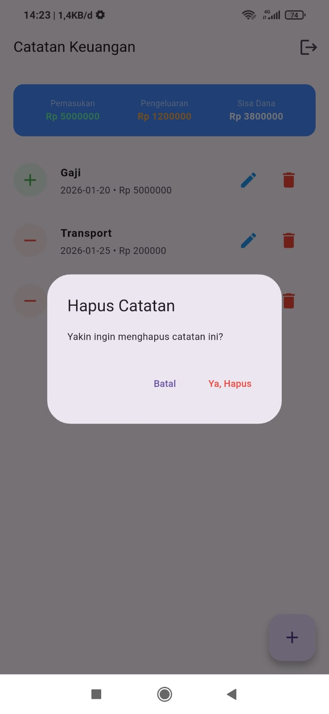

# 📱 Catatan Keuangan (UAS - Mobile Programming)

Aplikasi manajemen keuangan pribadi berbasis **Flutter** dan **Firebase** yang dirancang untuk membantu pengguna mencatat pemasukan dan pengeluaran secara cerdas, aman, dan real-time.

---

## 🚀 Tech Stack

- **Framework**: Flutter (Multi-platform)
- **Backend**: Firebase Authentication & Cloud Firestore (Real-time Database)
- **State Management**: Provider
- **Local Features**: Shared Preferences & Flutter Local Notifications

---

## ✨ Fitur Utama & Dokumentasi Antarmuka

### 🔐 1. Sistem Keamanan & Autentikasi

Fitur pendaftaran dan masuk akun menggunakan **Firebase Auth** dengan validasi pesan error yang ramah pengguna.
| Halaman Login | Halaman Register |
|---|---|
|  |  |

### 📊 2. Real-time Dashboard & Cloud Sync

Sinkronisasi otomatis dengan **Cloud Firestore**. Setiap data yang dimasukkan akan langsung tersimpan di server secara aman.
| Dashboard Utama | Evidence Cloud (Firestore) |
|---|---|
|  |  |

### 📝 3. Manajemen Catatan (CRUD)

Pengguna dapat mengelola catatan keuangan dengan fitur tambah, edit, dan hapus yang dilengkapi dialog konfirmasi.
| Form Tambah Catatan | Form Edit Catatan | Pilihan Tanggal |
|---|---|---|
|  |  |  |

> **Fitur Keamanan Data**: Terdapat peringatan konfirmasi sebelum menghapus data untuk mencegah kehilangan catatan secara tidak sengaja.
> 

### 🔔 4. Scheduling Notification (Reminder)

Sistem pengingat otomatis yang dijadwalkan setiap hari pukul **20:00** untuk mengingatkan pengguna mencatat keuangan.

- Implementasi: `Flutter Local Notifications` & `Timezone`.
- Konfigurasi: Mendukung Android 13+ (Izin Alarm Presisi).

---

## 🛠️ Detail Teknis

### 🏗️ Struktur Proyek

Aplikasi ini menggunakan pola **Clean Architecture** untuk pemisahan logika:

- **Services**: Menangani komunikasi Firebase dan Lokal.
- **Providers**: Manajemen state aplikasi.
- **Screens/Widgets**: Antarmuka pengguna yang responsif.

### ⚙️ Konfigurasi Lingkungan

- **Framework**: Flutter 3.x
- **Min SDK**: 23 (Android 6.0+)
- **Tested Device**: POCO M3 (Android 11/12/13)

---

## 🧪 Pengujian & Instalasi

Aplikasi telah melewati tahap **Unit Testing** pada fungsionalitas model data.

**Cara Menjalankan Test:**

```bash
flutter test test/transaction_test.dart
```
